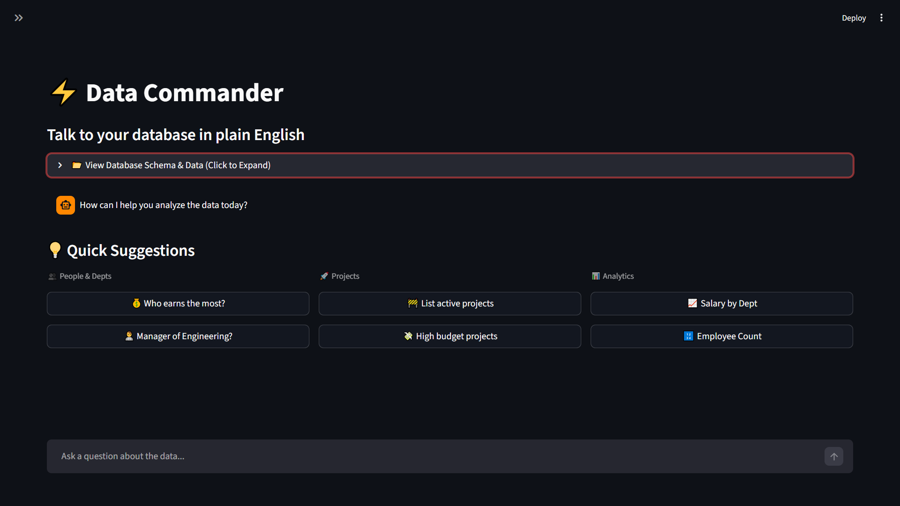

# ⚡ SQL Data Commander

### Talk to your data. Zero SQL required.


**SQL Data Commander** is a Generative AI application that bridges the gap between non-technical users and complex databases. By leveraging **Google Gemini**, it translates natural language questions into optimized SQL queries, executes them against a live database, and automatically visualizes the results.

---

## 🚀 Key Features

* **🤖 Natural Language to SQL Engine:** Converts plain English (e.g., *"Who earns the most in Engineering?"*) into executable SQL.
* **📊 Smart Auto-Visualization:** Detects data types in query results and automatically generates interactive Bar Charts using **Plotly**.
* **💬 Modern Chat Interface:** Features a conversational UI with history, similar to ChatGPT.
* **📂 Live Database Inspector:** Interactive **Tabs** to explore real-time data across Employees, Departments, and Projects tables.
* **🎲 Dynamic Data Seeding:** Includes a robust `seed_data.py` script powered by **Faker** to generate realistic, large-scale datasets for testing.
* **⚡ "Action Tile" Suggestions:** Categorized quick-start buttons (People, Projects, Analytics) to guide users.

---

## 🛠️ Tech Architecture

| Component | Technology | Description |
| :--- | :--- | :--- |
| **Frontend** | Streamlit | Reactive web framework for the UI/UX. |
| **LLM Core** | Google Gemini 2.5 flash lite | Handles NL-to-SQL translation. |
| **Database** | SQLite3 | Lightweight relational database. |
| **Visualization** | Plotly Express | Interactive charting library. |
| **Data Gen** | Faker | Generates realistic synthetic business data. |

---

## 📦 Installation & Setup

Follow these steps to set up the project locally.

### 1. Clone the Repository
```bash
git clone [https://github.com/YOUR_USERNAME/auto-sql-generator.git](https://github.com/YOUR_USERNAME/auto-sql-generator.git)
cd auto-sql-generator
```

### 2. Create a Virtual Environment
```bash 
# Windows
python -m venv venv
.\venv\Scripts\activate

# Mac/Linux
python3 -m venv venv
source venv/bin/activate
```

### 3. Install Dependencies
```bash
pip install -r requirements.txt
```
### 4. Seed the Database
Run the seeding script to generate a fresh company.db file with 50+ rows of realistic dummy data.

```bash
python seed_data.py

```

### 5. Configure API Key
You need a Google Gemini API key. You can enter it in the app sidebar


### 5. Run the application
Run the application:
```bash 
streamlit run app.py
```

## 📸 Screenshots




## 📂 Project Structure

auto-sql-generator/
├── app.py                 # Main application logic (Streamlit + LLM)
├── seed_data.py           # Database generation script (Faker)
├── requirements.txt       # Project dependencies
├── company.db             # SQLite database (generated by seed script)
├── .gitignore             # Git configuration
└── README.md              # Documentation

## Author

Built by Haaris Khalil